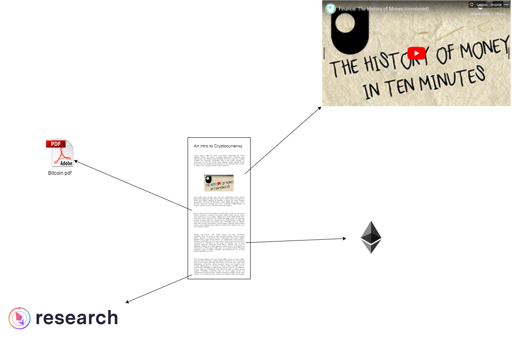
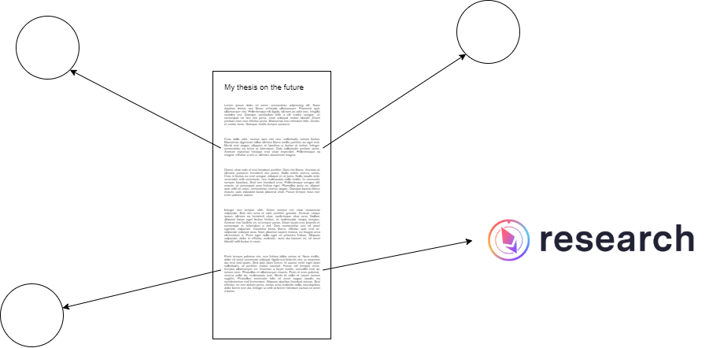
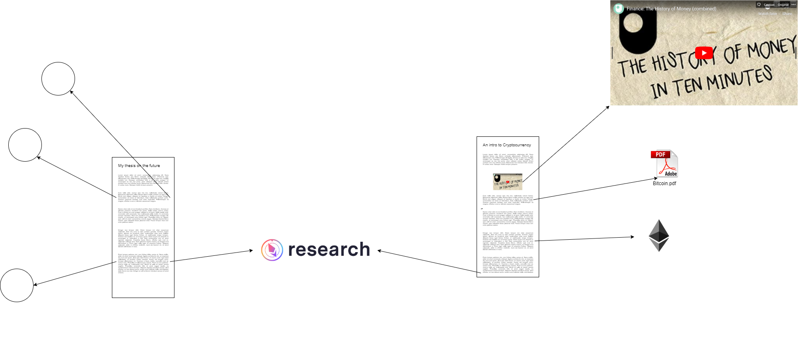
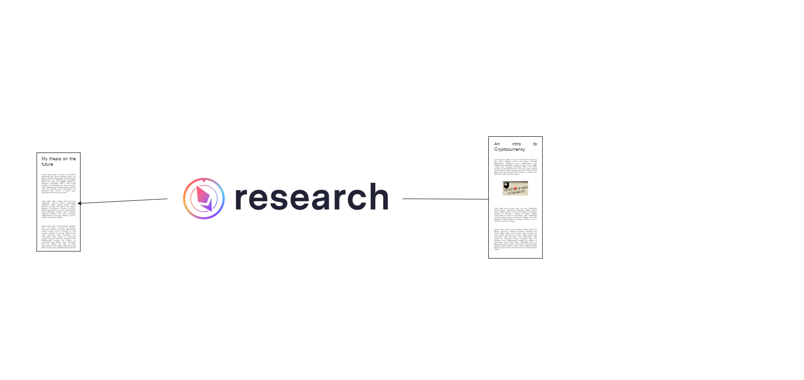
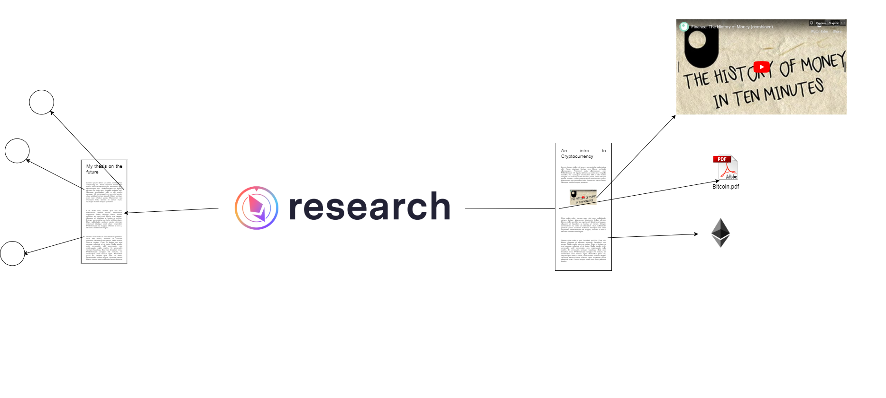
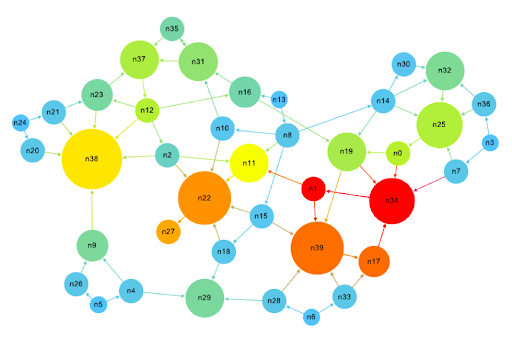

# The research use case

## The context to a piece of content

Imagine I'm writing an article introducing a reader to the world of cryptocurrency and distributed ledger technologies.

I begin my article linking to a video recapping the history of money:

[https://www.youtube.com/watch?v=YCN2aTlocOw](https://www.youtube.com/watch?v=YCN2aTlocOw)

I decide to include [Nick Szabo's](http://unenumerated.blogspot.com/) blog about the nature and history of money

After describing how something like bitcoin fits into the picture, and how it came about, maybe I want to reference the bitcoin whitepaper. So I [link](http://bitcoin.org/bitcoin.pdf) to it.

After summarizing its workings for people who didn't read the paper, maybe I want to begin writing about Ethereum, so I link to the whitepaper, which is a [GitHub repository](https://github.com/ethereum/wiki/wiki/White-Paper).

I describe where Ethereum research happens, linking to a community called [ethresear.ch](http://ethresear.ch)

With just these links, the context of my article looks like this.

**I've written this article both for myself as a reference, and for the world as a resource to learn about my work.**

## Shared Context

Now let's say I shift my focus to writing about the future in general. 

Among many other things, I'm interested in the future of digital money, and the other uses of the underlying technology. I mention how, despite the bear market in valuations, the amount of research activity is very high, and as an example, I point to [ethresear.ch](http://ethresear.ch).

And then, I move on. This is my article's context

**But notice how I referenced the Ethereum Research site in two different articles?**

The shared context really looks like this:

Most people perform work within a specific area, and are bound to reference the same resources time and time again:

- A learner referencing her notes
- A researcher referencing notes, papers (perhaps in form of PDFs, or URLs)
- A journalist referencing videos, news articles, and anything else.

### Exploring context

Now if we were to click on the Ethereum Research node, and visualize its context, we get something like this:

We discover our two articles that referenced the Ethereum Research website.

Next up, we add another degree of connections. Now we're looking at everything linked to anything that links to Ethereum Research.

It's trivial to do this for any piece of content we've added. I can see what the rest of my 'content universe' looks like, picking any point as the center.

Over time I'm creating my own universe of relevance. It's an OpenMind space with all the content relevant to me. It's got my writing, URLs to articles I've read and referenced, PDFs that I've used, and any other type of content relevant to me.

This is a powerful position to be in. Let's explore some of the abilities I've been granted.

## A search engine for my brain

Now, my writing exists alongside my primary sources. I can look up where my ideas have originated from. They could be a consequence of connecting several ideas (synthesis), or out of nothing (synthesis ex nihilo). 

I always have a 'dependency tree' of my research.

And this can be made searchable, benefitting:

- me: I can now look up the origins of my ideas.
- my friends and colleagues
- the wide world: which now has a way to query my mind in detail.

Here's an example: I love reading Tyler Cowen's blog on economics called Marginal Revolution. I happen to read this article today about the [vulnerability of supply chains](https://marginalrevolution.com/marginalrevolution/2020/02/how-robust-are-supply-chains.html): 

[https://marginalrevolution.com/marginalrevolution/2020/02/how-robust-are-supply-chains.html](https://marginalrevolution.com/marginalrevolution/2020/02/how-robust-are-supply-chains.html)

**I add this URL to my OpenMind (by referencing it within an article, or simply adding the URL).**

**A sample implementation of the 'URL' type could include the process of crawling the webpage at the URL, and storing a copy of the text.**

In the article above, Tyler mentions the vulnerability of a modern supply-chain practice called *Zero Inventory,* where businesses don't maintain redundancy for the sake of efficiency.

**Now that OpenMind has crawled the URL, you can search for the term 'Zero Inventory', and discover Tyler's article on my OpenMind.**

Short of Elon's Neuralink becoming reality, this is the closest you get to searching my brain!

## The most cited

A popular question someone might ask when they meet you for the first time is about your interests. What does your information diet look like? What books and articles do you read? 

I believe OpenMind is set up to provide a type of query which answers this very question. 

Let's say I'm a massive fan of Paul Graham and Tyler Cowen. I often connect their ideas to other content on my OpenMind: say by referencing them in my articles and messages.

- A note on PageRank:

    PageRank is a way to determine relevance in a graph on the basis of citation. It's the algorithm that formed the basis for Google Search: articles on the world wide web would link to each other, and the most valuable articles were the ones being linked to the most.

    In the following depiction, the PageRank of the nodes is visualized to discover the central nodes.

    

When you discover my OpenMind, perhaps one of the layouts that you can look at show you the pieces of content that are central to my thinking.

They could be my own articles.

Or they could be links to content created by other people on the internet that I like to reference.

If I often return to Paul Graham's idea of [doing things that don't scale](http://paulgraham.com/ds.html), it will have been referenced in a lot of my writing. It would appear as a large node, connected to my articles that reference it.

## Design decisions from this use case:

- The content is the atomic unit of OpenMind
- A variety of types exist, and their behaviors differ
- A View or a Layout is a way to observe how things connect on the graph.

In this article I describe how our decisions about the data structure lend themselves to be fit for this usecase:

[Why this data structure?](https://www.notion.so/Why-this-data-structure-ceff1b925fa24d858250b2695561172c)

The continuation to this is exploring the research use case in teams:

[The research use case, in teams.](https://www.notion.so/The-research-use-case-in-teams-d3d7fb78bbad4c01ada538215d7314ab)