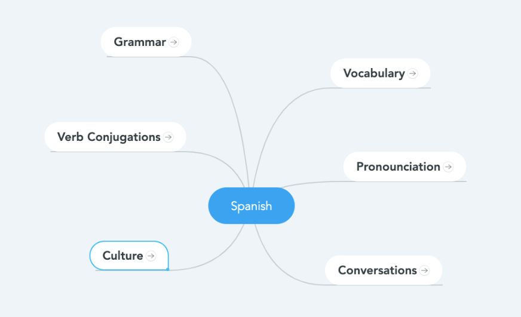

# Language Learning

## Overview

On a mind mapping platform like Mindmeister, I currently have my Spanish learning map organized such that each node in the top level map links to another mindmap that goes into greater detail.

A look into our vocabulary map reveals the following. 

This mindmap is powerful because it uses visuals and associations to enhance the integration of new knowledge. 

## Concept

In this concept, our food space has information and connections. We’ll call these our neurons and synapses.

### Space

A space is a collection of neurons and synapses. A space is represented by a path. In our example, the Spanish space would be at `/spanish`, from which would emerge paths to other spaces such as `/spanish/vocabulary` and `/spanish/grammar`

Users can create spaces by grouping a number of neurons and synapses together. If a cluster of neurons and synapses cluster around a theme, there’s potential to create a space.

### Neuron

A neuron is a node of information. On our map, these are represented as a single entity on the graph. A neuron contains:

* **data**, which has the raw information held by the neuron.
* **meta**, which is a key-value store of information such as the neuron’s creator, content-type, creation date, etc.

### Synapse

A synapse is a connection between two neurons. Synapses can be augmented by adding data that describes the kind of connection it is. **In our example**, the synapse between the word and its translation has such an augmented connection. A learner could query such connections from the food space to practice their translation of food vocabulary. 

## Advantages over Mindmeister

### No Central Idea

Mindmeister forces a central idea for each map, and so constricts the user’s freedom to organize their thoughts as they see fit. 

**In our example's** food vocabulary space, we see no central neuron that forces all other neurons to be connected to it. 

### Powerful Neurons

Our pronunciation neuron has audio and text, something not allowed by mindmeister. Other powerful neurons could include:

* Having text that describes a video to help associate more visuals to the text being read in a language that’s being acquired. 
* An embedded web app that contains a small game for Spanish food categorization
* Portals

### Portals

Open Mind introduces the concept of *portals* into spaces, whereby users can navigate between spaces with low friction. Users can create portals by establishing synapses to other spaces, or to neurons from other spaces. 

Instead of visiting a new web page to view a linked map, portals allow a user to expand the neurons and synapses from the portal’s *space* into the mindmap. 

**In our example**, we connected our apple neuron to the red color neuron from the `/vocabulary/colors` space. If a user wants to review other colors from the colors space, they’re able to through this neuron. 

**In our example**, we also linked the associative sentence to the `/grammar/gustar` space, thus creating a portal to that space. Mapping sentences to the grammatical concepts embedded within them, and having access to the grammar topic’s content in a low friction manner is valuable for language learners. 